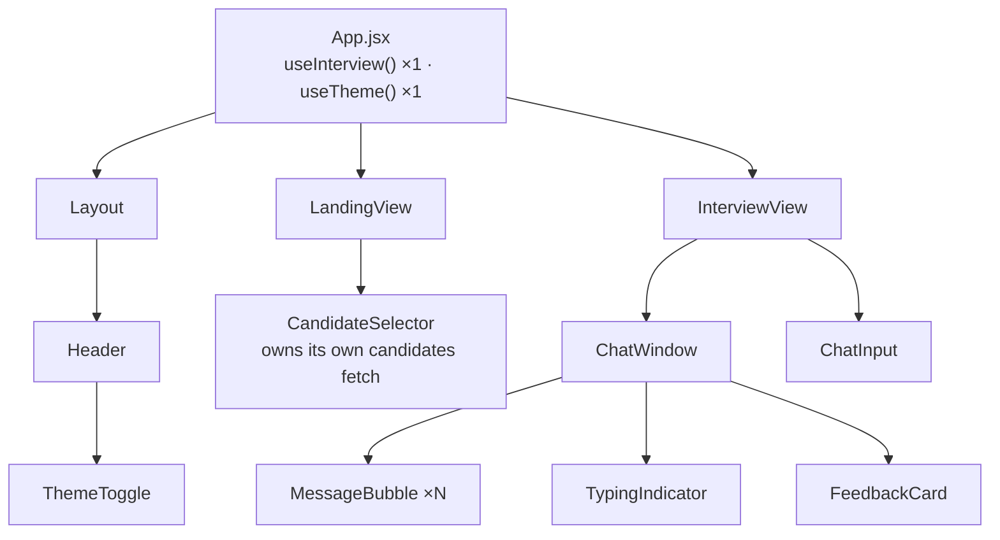
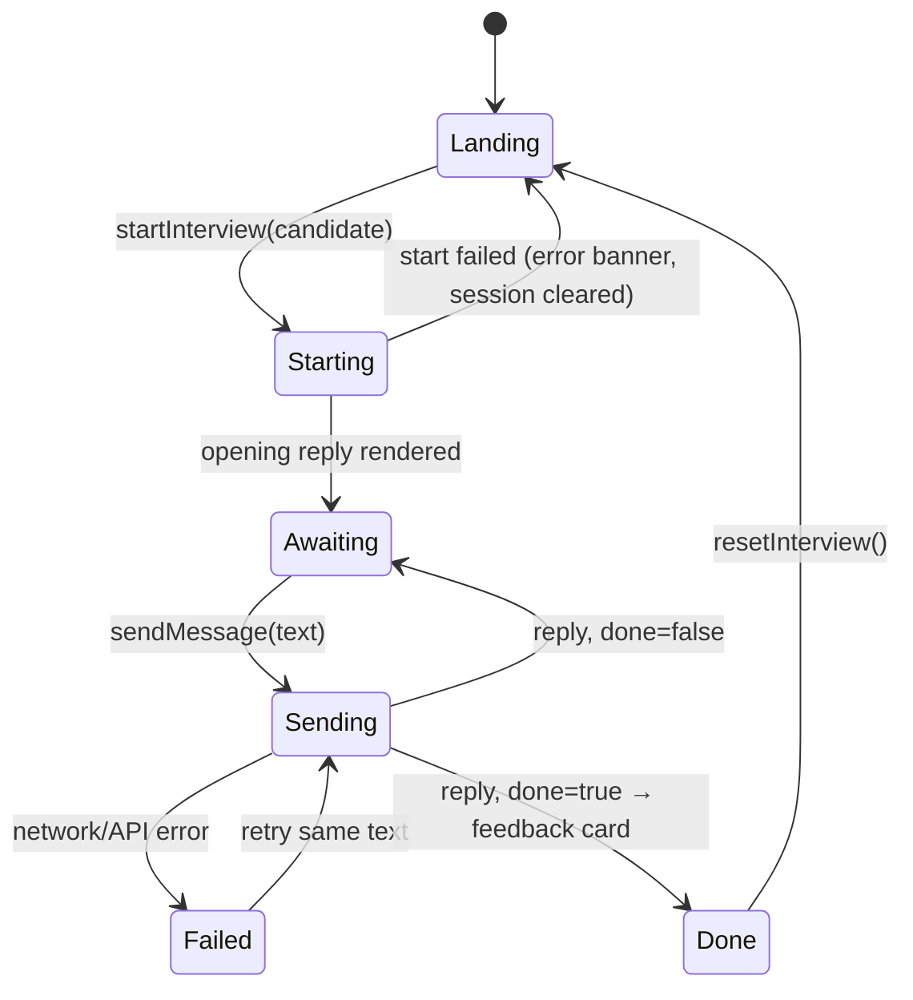
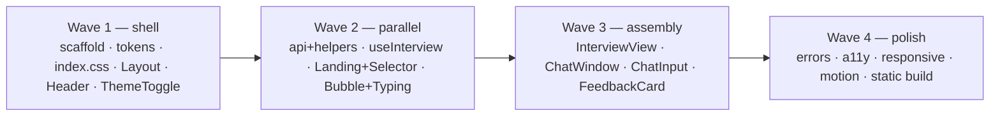

# ProbeAI — Frontend Architecture Specification

**Status:** design frozen for implementation · **Consumers:** frontend team
**Companion doc:** [ARCHITECTURE.md](ARCHITECTURE.md) (backend contract — §3 there is the source of truth for the API)

A premium, single-page chat interface for the ProbeAI technical interviewer. Dark by default, light on
toggle, no UI or icon libraries.

---

## 1. Principles & non-goals

1. **One source of truth for interview state.** `useInterview` is instantiated exactly once, in `App`.
   Everything else receives props. No global store, no duplicate fetching.
2. **Derived state is never stored.** Which view renders, whether the input is disabled, whether the
   feedback card shows — all computed from primitives. Storing a `view` string invites drift.
3. **Theme is CSS, not JSX.** Semantic CSS variables flip on `.dark`; components use semantic Tailwind
   names. A component should almost never contain a `dark:` variant.
4. **The network is slow and visible.** A turn can take several seconds. Latency is a first-class UI
   state (typing indicator), not an afterthought.
5. **Never lose what the candidate typed.** A failed send keeps the message on screen, marked, retryable.
6. **It must not look like a hackathon project.** Motion is subtle and consistent; spacing is generous;
   nothing is decorative.

**Non-goals (v1):** routing/deep links, streaming responses, transcript export, markdown rendering
beyond line breaks, i18n, offline support, mobile-first optimization (usable, not optimized).

---

## 2. Stack & layout

| Concern | Choice |
|---|---|
| Framework | React 18, function components + hooks, plain JSX |
| Build | Vite 5 |
| Styling | Tailwind CSS **3.4** (`darkMode: 'class'`) + PostCSS + Autoprefixer |
| State | Local hooks only — no Redux, Zustand, or Context for interview state |
| Icons | Inline SVG (send, sun, moon, check, arrow, alert) |

> Tailwind v3 is specified deliberately: the required `tailwind.config.js` + `postcss.config.js` pair is
> the v3 setup. If anyone upgrades to v4, config moves into CSS and §3 must be rewritten — that is a
> decision, not a version bump.

```
frontend/
  index.html                 # #root, Inter preconnect+link, no-flash theme script
  vite.config.js             # /api proxy → http://localhost:8000
  tailwind.config.js         # darkMode:'class', semantic color tokens
  postcss.config.js
  package.json
  src/
    main.jsx                 # createRoot
    App.jsx                  # owns useInterview + useTheme, picks the view
    index.css                # @tailwind, CSS variables, keyframes, scrollbar
    hooks/
      useInterview.js        # THE BRAIN — session, messages, loading, done, feedback, error
      useTheme.js            # isDark + toggle + localStorage + <html> class
      useCandidates.js       # roster fetch + loading/error status (called in CandidateSelector)
      useChatDraft.js        # answer draft + submit (called in ChatInput)
    components/
      Layout.jsx  Header.jsx  ThemeToggle.jsx
      LandingView.jsx  CandidateSelector.jsx
      InterviewView.jsx  ChatWindow.jsx  MessageBubble.jsx
      TypingIndicator.jsx  ChatInput.jsx  FeedbackCard.jsx
    utils/
      api.js                 # fetchCandidates, startInterview, sendMessage
      helpers.js             # createSessionId, createMessageId, formatCandidateLabel
```

---

## 3. Design system

### 3.1 Token strategy (the one styling decision everything else depends on)

Define both palettes as CSS variables in `index.css`, then expose them to Tailwind under **semantic**
names. Components write `bg-surface`, never `bg-[#1A2420] dark:bg-[#F0F2EC]`.

```css
:root {                        /* light */
  --bg:#FAFAF8;  --surface:#FFFFFF; --elevated:#F0F2EC;
  --accent:#E4FD97;
  --text:#2D3E2C; --text-muted:#6B7B6A; --border:#D4DDD2;
  --bubble-interviewer:#F0F2EC; --bubble-candidate:#E4FD97; --bubble-candidate-text:#2D3E2C;
  --input-bg:#FFFFFF; --input-border:#D4DDD2; --input-focus:#2D3E2C;
  --btn-bg:#2D3E2C; --btn-text:#E4FD97; --btn-hover:#3A5039;
  --scrollbar-track:#F0F2EC; --scrollbar-thumb:#D4DDD2;
}
.dark {                        /* dark — DEFAULT */
  --bg:#0F1610;  --surface:#1A2420; --elevated:#223029;
  --accent:#E4FD97;
  --text:#E8E8E0; --text-muted:#8A9A88; --border:#2D3E2C;
  --bubble-interviewer:#1A2420; --bubble-candidate:#2D3E2C; --bubble-candidate-text:#E8E8E0;
  --input-bg:#1A2420; --input-border:#2D3E2C; --input-focus:#E4FD97;
  --btn-bg:#E4FD97; --btn-text:#2D3E2C; --btn-hover:#d4ed87;
  --scrollbar-track:#1A2420; --scrollbar-thumb:#2D3E2C;
}
```

```js
// tailwind.config.js
colors: {
  bg:'var(--bg)', surface:'var(--surface)', elevated:'var(--elevated)',
  accent:'var(--accent)', border:'var(--border)',
  text:{ DEFAULT:'var(--text)', muted:'var(--text-muted)' },
  bubble:{ interviewer:'var(--bubble-interviewer)', candidate:'var(--bubble-candidate)',
           candidateText:'var(--bubble-candidate-text)' },
  input:{ bg:'var(--input-bg)', border:'var(--input-border)', focus:'var(--input-focus)' },
  btn:{ bg:'var(--btn-bg)', text:'var(--btn-text)', hover:'var(--btn-hover)' },
}
```

**Known limitation:** raw `var()` colors don't support Tailwind opacity modifiers (`bg-accent/20`).
Where a translucent accent is needed (error tints, hover washes), add a dedicated variable rather than
reaching for a modifier. If the team wants modifiers everywhere, store channel triplets
(`--accent: 228 253 151`) and map as `rgb(var(--accent) / <alpha-value>)` — decide once, in Wave 1.

### 3.2 Typography & spacing

| Token | Value |
|---|---|
| Font | `Inter` (Google Fonts, weights 400/500/600/700), fallback system sans |
| Body / chat | 15px, line-height 1.7 |
| Logo `PROBEAI` | mono or `tracking-[0.25em]`, uppercase, accent in dark / `--text` in light |
| Chat column | `max-w-[800px]` centered |
| Bubble | `max-w-[85%]`, padding `14px 18px`, `rounded-2xl` + sharp inner corner |
| Message gaps | 4px same sender · 16px sender change |
| Header | ~60px, 1px bottom border |
| Input bar | 60–70px, sticky, 1px top border, page background |

### 3.3 No-flash theme boot

Dark is the default and must paint dark on first frame. Inline this in `index.html` **before** the
bundle — reading localStorage inside a `useEffect` produces a visible light flash:

```html
<script>
  try {
    var t = localStorage.getItem('probeai-theme');
    if (t !== 'light') document.documentElement.classList.add('dark');
  } catch (e) { document.documentElement.classList.add('dark'); }
</script>
```

`useTheme` then reads the class that's already there rather than re-deciding.

---

## 4. State architecture



**Ownership rules**

| State | Owner | Notes |
|---|---|---|
| `sessionId`, `messages`, `isLoading`, `isDone`, `feedback`, `error`, `selectedCandidate` | `useInterview` in `App` | passed down as props |
| `isDark`, `toggleTheme` | `useTheme` in `App` | props to `Header` → `ThemeToggle`; no Context needed |
| candidate list + fetch status | `useCandidates()`, called in `CandidateSelector` | only that component needs it; keeps `App` clean |
| draft input text | `useChatDraft()`, called in `ChatInput` | never lifted to `App` — that would re-render the whole tree per keystroke |
| scroll position | `ChatWindow` (ref) | not React state |

**On project rule 7 ("hooks contain ALL state logic").** The two local pieces of state above live in
hooks that are *called inside* the components that own them. A hook invoked in a component keeps
re-renders exactly as local as `useState` does, so the rule holds at zero performance cost — only
*lifting* state to `App` would have been expensive. The scroll position is a `useRef`, not state.

**Derived, never stored:** `view = sessionId ? 'interview' : 'landing'` · `canSend = draft.trim() && !isLoading && !isDone` ·
`showTyping = isLoading` · `showFeedback = isDone && feedback`.

---

## 5. View & turn state machine



`Starting` and `Sending` both surface as `isLoading = true`; the difference is only which view is mounted.

---

## 6. Component contracts

Build to these props. Anything needing an extra prop changes this table first.

### `App.jsx`
Instantiates both hooks, renders `Layout` + (`LandingView` | `InterviewView`) from derived `view`.
**Done when:** switching views never remounts `Header`, and no state lives above `App`.

### `useTheme()` → `{ isDark, toggleTheme }`
Reads the class set by the boot script; toggle flips `isDark`, writes `localStorage['probeai-theme']`,
adds/removes `dark` on `document.documentElement`.
**Done when:** reload preserves the choice and there is no light flash on a dark-mode load.

### `useInterview()` → `{ sessionId, selectedCandidate, messages, isLoading, isDone, feedback, error, startInterview, sendMessage, retryLast, resetInterview, dismissError }`

```js
message = { id, role: 'interviewer'|'candidate', content, timestamp, status?: 'sent'|'failed' }
```

| Method | Behaviour |
|---|---|
| `startInterview(candidate)` | generate `sessionId` → set candidate + `isLoading` → `POST /api/interview {sessionId, candidate}` → push interviewer message → `isLoading=false`. **On error:** clear `sessionId` (stay on landing), set `error`. |
| `sendMessage(text)` | push candidate message optimistically → `isLoading=true` → `POST {sessionId, message}` → push interviewer reply; if `done===true` set `isDone` + `feedback` → `isLoading=false`. **On error:** mark that message `status:'failed'`, set `error`, keep the text. |
| `retryLast()` | re-send the last failed message **without appending a second bubble** — flip its status back and reuse its text. |
| `resetInterview()` | all state to initial. Session is server-side and in-memory; abandoning it is fine. |

**Guards:** ignore `sendMessage` when `isLoading` or `isDone`; ignore `startInterview` when a session
exists. **Done when:** a rapid double-submit produces exactly one request, and a failed send followed
by retry yields exactly one candidate bubble.

### `Layout.jsx`
`{ children, header }` — full-height flex column, page background, `min-h-dvh` (not `min-h-screen`;
mobile browser chrome).

### `Header.jsx` → props `{ candidate, isDark, toggleTheme }`
Left `PROBEAI` + tagline (tagline hidden `< md`). Center: candidate pill (`Name | Role | 9y exp`),
rendered **only when `candidate` is set**. Right: `ThemeToggle`. Pill truncates rather than wraps.

### `ThemeToggle.jsx` → `{ isDark, onToggle }`
Inline sun/moon SVG, 180° rotation over 300ms, `aria-label` describing the *target* theme, borderless
with a hover wash. Respects `prefers-reduced-motion`.

### `LandingView.jsx` → `{ onStart, isLoading, error, onDismissError }`
Centered column: large `PROBEAI`, tagline, one-line explainer, `CandidateSelector`. No sidebar.

### `CandidateSelector.jsx` → `{ onStart, isStarting }`
Owns `GET /api/candidates` on mount + `{ loading | error | ready }`. Options are
`formatCandidateLabel(c)` → `"Sarah Johnson — Senior Data Engineer (9 years)"`, sourced entirely from
the API (names in the build prompt are illustrative). Placeholder `Choose a candidate…`. Start button:
disabled+dimmed with no hover when nothing is selected or `isStarting`; shows `Starting…`/spinner while
starting. Load failure renders `Could not load candidates. [Retry]`.
**Contract:** `onStart` receives the **entire candidate object verbatim** — the backend expects
`member`/`missions`/`signals` exactly as served. Never reshape or trim it.

### `InterviewView.jsx` → `{ messages, isLoading, isDone, feedback, error, onSend, onRetry, onReset, onDismissError }`
Header (from `Layout`) / `ChatWindow` flex-1 / `ChatInput` or `FeedbackCard` footer.

### `ChatWindow.jsx` → `{ messages, isLoading, isDone, feedback, onRetry, onReset }`
Scroll container, `chat-scrollbar`, 800px centered column. Renders bubbles, then `TypingIndicator` when
`isLoading`, then `FeedbackCard` when `isDone && feedback`.
**Auto-scroll:** `useEffect` on `[messages.length, isLoading, isDone]` scrolling a bottom sentinel ref
with `behavior:'smooth'`. Sender grouping: 4px gap when `role === previous.role`, else 16px.
`aria-live="polite"` on the list so new interviewer messages are announced.

### `MessageBubble.jsx` → `{ message, isGrouped, onRetry }`
Interviewer: left, `bg-bubble-interviewer`, 1px border, `rounded-2xl rounded-tl-sm`, small circular
`P` avatar (hidden when `isGrouped`). Candidate: right, `bg-bubble-candidate`,
`text-bubble-candidateText`, `rounded-2xl rounded-tr-sm`, no avatar. Both `max-w-[85%]`,
`whitespace-pre-wrap` (line breaks yes, markdown no), `.message-enter` on mount.
`status === 'failed'` → muted/tinted bubble + inline `Message failed to send. [Retry]`.

### `TypingIndicator.jsx`
Left-aligned compact interviewer bubble, three staggered dots (0/150/300ms), optional
`ProbeAI is thinking…`. Static dots under `prefers-reduced-motion`.

### `ChatInput.jsx` → `{ onSend, disabled, autoFocusKey }`
Auto-growing textarea (max 4 rows then scroll), placeholder `Type your answer…`. **Enter** sends,
**Shift+Enter** newline, **Escape** blurs. Send button = inline arrow SVG, accent, `active:scale-95`,
disabled when empty or `disabled`. Clears the draft only after `onSend` is invoked.
**Focus rule:** re-focus when `autoFocusKey` changes (App passes `messages.length`) — focusing must
happen *after* `isLoading` flips false, or it lands on a disabled element. Skip autofocus below `md`
so the mobile keyboard doesn't ambush the user.

### `FeedbackCard.jsx` → `{ feedback, onReset }`
Wider than a bubble (full chat column), elevated surface, accent left/top border, `.feedback-enter`.
Sections: title `Interview Complete` · `summary` emphasized · **Strengths** (accent check markers) ·
**Areas for Improvement** (amber markers — never labelled "Gaps" in the UI) · **Recommended Next Steps**
(arrow markers) · `Start New Interview` → `onReset()`. Empty arrays render nothing — no empty headers.
Replaces `ChatInput`; the input is not merely disabled but unmounted.

---

## 7. API layer & error taxonomy

`utils/api.js` exposes `fetchCandidates()`, `startInterview(sessionId, candidate)`,
`sendMessage(sessionId, message)` against `API_BASE = '/api'` — same origin in production, Vite proxy in
dev. Parse `detail` out of FastAPI error bodies so the UI can be specific:

| Backend | Cause | UI treatment |
|---|---|---|
| 400 | neither field sent | dev bug — generic banner |
| 404 | unknown `sessionId` (server restarted) | banner: *This interview session expired.* + `Start New Interview` |
| 409 | turn after completion | ignore + ensure `isDone` is true (state desync) |
| 422 | malformed body | dev bug — generic banner |
| 503 | Gemini unavailable | inline retry on the failed message: *The interviewer is unavailable. [Retry]* |
| network/timeout | offline, backend down | same as 503 |

All errors dismissible and non-blocking. **Timeouts:** interview turns are LLM-bound and can run tens
of seconds — if an `AbortController` timeout is added, set it ≥60s. A short default timeout will fire
mid-answer and look like a bug.

---

## 8. Motion

| Element | Animation |
|---|---|
| Message mount | `messageIn` — opacity 0→1, `translateY(8px)→0`, 300ms ease-out |
| Typing dots | `dotPulse` 1.4s infinite, staggered 0/150/300ms |
| Feedback card | `feedbackIn` — 20px rise, 500ms ease-out |
| Theme switch | `background-color`/`color` 300ms ease on `html`, `body`, surfaces |
| Send button | `active:scale-95` |
| Theme icon | 180° rotate, 300ms |

CSS keyframes only, no animation library. Wrap all of it in a global
`@media (prefers-reduced-motion: reduce) { animation: none; transition: none; }` escape hatch — motion
this pervasive is a genuine accessibility problem otherwise.

**Scoping note:** a blanket `transition: all` on every element makes the theme toggle janky with 40+
bubbles mounted. Transition only the properties listed above.

---

## 9. Accessibility & keyboard

- `Enter` send · `Shift+Enter` newline · `Escape` blur (all local to `ChatInput`; no global listeners).
- Message list `role="log" aria-live="polite"`; typing indicator `aria-label="ProbeAI is thinking"`.
- Every icon-only button carries an `aria-label`; SVGs are `aria-hidden`.
- Visible focus ring on the input, send button, dropdown, and both CTAs — accent in dark, `--text` in light.
- Verify ≥4.5:1 for `--text-muted` on `--surface` in **both** themes before sign-off; the muted greens
  are the only pairs at real risk.

---

## 10. Responsive

| Breakpoint | Behaviour |
|---|---|
| ≥1024px | 800px centered column, generous spacing |
| 768–1023px | full width, 24px side padding |
| <768px | full width, 12px padding, 14px text, header tagline hidden, candidate pill truncated, autofocus off |

Use `dvh` units for full-height regions.

---

## 11. Build & deployment

**Dev:** `vite` on 5173 with `server.proxy['/api'] → http://localhost:8000`; `uvicorn main:app --reload
--app-dir backend` alongside. Backend CORS is already open, so a direct base URL also works — but the
proxy keeps `API_BASE='/api'` identical in both environments, which is why it's specified.

**Prod (hard constraint 10):** `vite build` → `frontend/dist`, served as static files by FastAPI. The
backend needs a mount, added **after** the API routes so it can't shadow them:

```python
FRONTEND_DIST = BASE_DIR.parent / "frontend" / "dist"   # config.py
if FRONTEND_DIST.is_dir():
    app.mount("/", StaticFiles(directory=FRONTEND_DIST, html=True), name="frontend")
```

Derived from `BASE_DIR`, not a relative string, because uvicorn runs with `--app-dir backend`. The
`is_dir()` guard keeps the backend starting before anyone has run `npm run build`.

**The health check moved.** `GET /` used to return health JSON, which meant the SPA could never own the
root. Health is now `/health` (alias `/api/health`), and `/` falls back to it only when no build exists.

Because view switching is state-based rather than routed, no SPA history fallback is required — `html=True`
serving `index.html` at `/` is sufficient. Keep Vite's default relative `base`.

---

## 12. Work breakdown



| Track | Scope | Depends on | Done when |
|---|---|---|---|
| **A — Shell & theme** | scaffold, Tailwind tokens, `index.css`, boot script, `Layout`, `Header`, `ThemeToggle` | — | both palettes render from §3.1, toggle persists, no flash, zero `dark:` variants in components |
| **B — Data layer** | `utils/api.js`, `utils/helpers.js` | A | all three calls typed and error-mapped per §7; works against the live backend |
| **C — Interview brain** | `useInterview` | B | §6 table passes, including double-submit guard and retry-without-duplicate |
| **D — Landing** | `LandingView`, `CandidateSelector` | A, B | 20 candidates load; disabled/starting/error states correct; candidate passed verbatim |
| **E — Chat surface** | `MessageBubble`, `TypingIndicator` | A | both roles pixel-match §3.2; grouping gaps correct; enter animation smooth |
| **F — Assembly** | `InterviewView`, `ChatWindow`, `ChatInput`, `FeedbackCard` | C, E | auto-scroll, autofocus-after-response, input disabled on loading/done, feedback slides in |
| **G — Polish & ship** | error surfaces, a11y, responsive, reduced-motion, static build + FastAPI mount | all | §13 checklist green |

Tracks B–E are genuinely parallel once Wave 1 lands. Mock data (a saved `/api/candidates` response and
one canned interview reply) unblocks D and E before the backend has a live Gemini key.

---

## 13. QA checklist

1. **Full run per archetype** — CAND-001 (senior), CAND-010 (struggling), CAND-011 (skipper): start →
   8–12 questions → feedback card. Sections populate; no empty headers.
2. **Latency** — typing indicator appears immediately and never overlaps the arriving message; input is
   disabled throughout and refocused after.
3. **Failure paths** — kill the backend mid-interview: the candidate's message stays, marked failed;
   retry after restart produces exactly one bubble; expired-session 404 offers a fresh start.
4. **Theme** — toggle at message 1 and message 12; reload in each theme; no flash, no jank with a long
   transcript.
5. **Keyboard only** — select a candidate, start, answer, and reset without touching the mouse.
6. **Reduced motion** — everything still readable and usable with animations off.
7. **Static build** — `vite build`, serve via FastAPI, hard-refresh: identical behaviour to dev.
8. **The judge test** — 1440px dark, 1440px light, 375px. Does it read as a product?

---

## 14. Decisions closed during implementation

1. **Opacity modifiers** — settled on plain `var()` colours. Instead of channel triplets, the handful of
   translucent/per-theme cases got their own semantic tokens: `--logo`, `--marker-good`, `--marker-next`,
   `--hover-wash`, `--tint-danger`. This keeps `dark:` variants out of components entirely, which was the
   point of §3.1. Accent-as-text was the forcing case: `#E4FD97` is invisible on the light background,
   so the logo and the "strengths" markers need a per-theme value, not an opacity tweak.
2. **Textarea, not input** — confirmed. Shift+Enter and auto-grow to a 4-line ceiling require it.
3. **Candidate pill truncation** — implemented as specified: role hides below `sm`, years below `md`,
   name always visible and truncated with ellipsis rather than wrapping.
